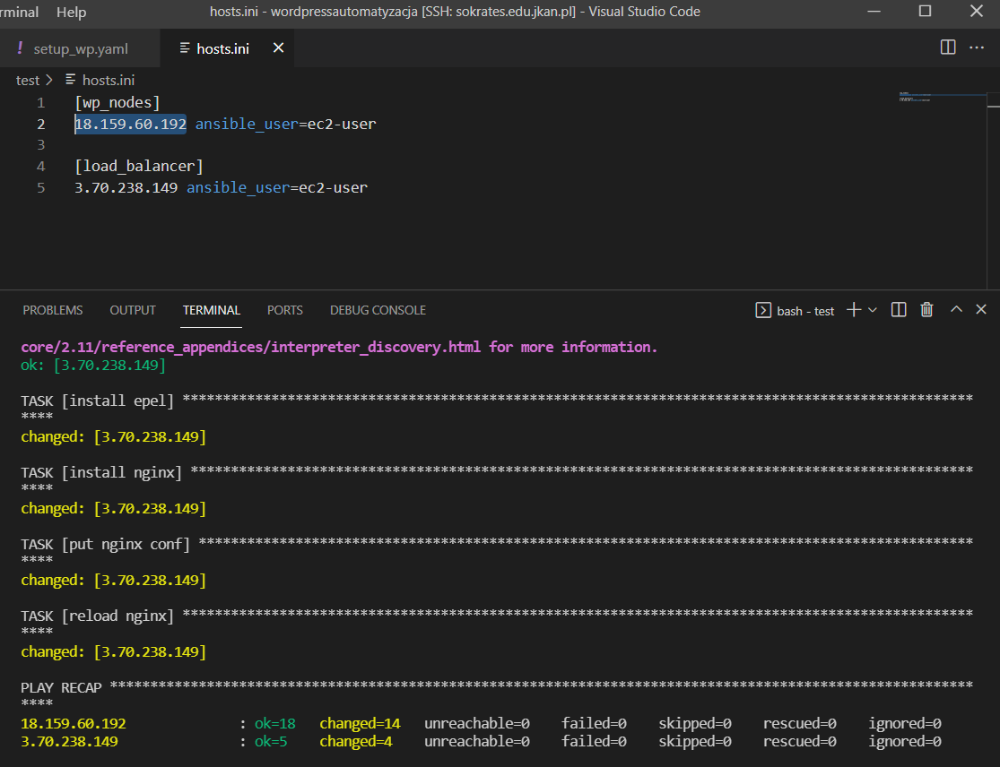
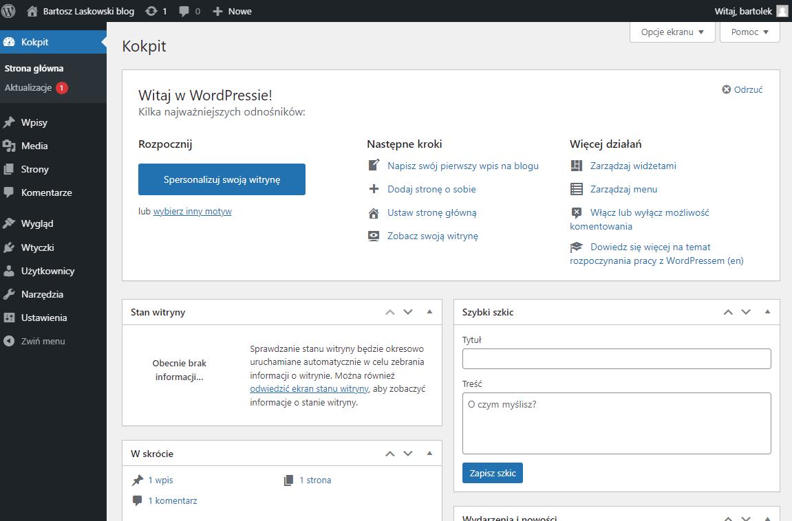

## AutomatyzacjaWordpressa

1. Stworzenie nowej instancji na AWS
2. Zalogowanie się na sokratesa, pobranie klucza SSH id_student
3. Połączenie się na instancję AWS poprzez sokratesa 
4. sudo yum update -y
5. Utworzenie pliku hosts.ini z adresami maszyn docelowych
6. Utworzenie pliku setup_wp.yaml z konfiguracją
7. Skopiowanie mardiacb repo
8. Instalacja MardiaDB serwer i klient
9. Instalacja modułu mysql
10. Stworzenie bazy danych
11. Stworzenie urzytownika oraz przypisanie mu uprawnien
12. Instalacja serwera HTTP
13. Instalacja EPEL
14. Instalacja php repo
15. Instalacja PHP80
16. Pobranie wordpressa
17. copy vhost cfg, copy wp cfg
18. Przeładowanie Apache
19. Wykonanie komendy ansible-playbook -i hosts.ini setup_wp.yaml -e DB_PW='witam'

